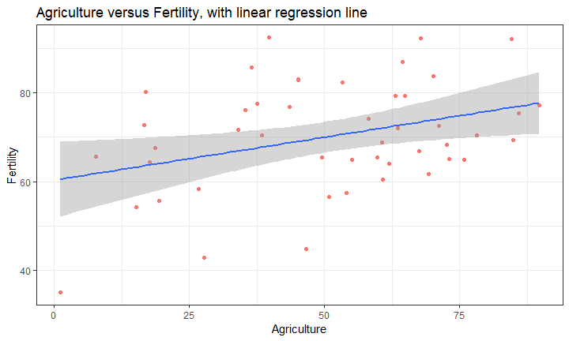

## Introduction

This presentation is part of the Peer Assignment for the Coursera course *Developing Data Products*.
The goal of the assignment is to create a simple app with *Shiny* and to create a corresponding pitch presentation.

## App

This app creates a plot with a linear regression line based on the dataset **swiss**, which is one of the default datasets in R. A short overview of the dataset can be found on [this][1] page.
The full code for the app and the pitch presentation can be found [here][2].
The webbased application can be [viewed][3].

## Code

The plot is constructed with the following code:


```r
        g <- ggplot(swiss, aes(x = xvar, y = Fertility)) +
             geom_point(aes(colour = "red"), show.legend = FALSE)
        g <- g + labs(x = labelx,
                   title = paste(labelx,
                   "versus Fertility, with linear regression line"))
        g <- g + theme_bw() + geom_smooth(method = "lm")
        g
```

The `xvar` is selected by the user. This is also used to set the Title and the label for the X-axis.

## Initial Plot

When the app is started, this is the initial plot.
<!-- -->


[1]: https://stat.ethz.ch/R-manual/R-devel/library/datasets/html/swiss.html "this"
[2]: https://github.com/kobe04/DevDataProductWeek4 "here"
[3]: https://kobe04.shinyapps.io/myfirstapp/ "viewed"
